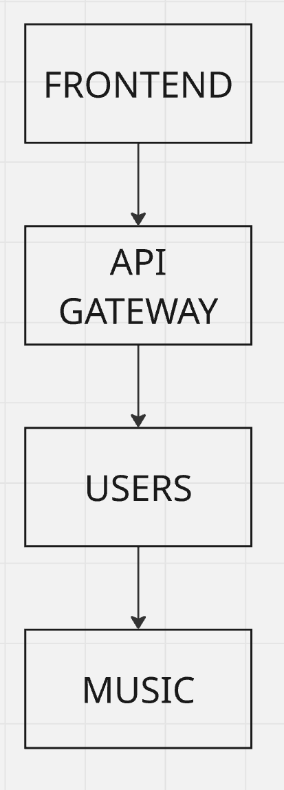

# Микросервис Music

Этот сервис управляет музыкальными данными (треки, альбомы, плейлисты и т.д.) для приложения Mute. Он подчиняется микросервису пользователей и выполняет его функции, ибо весь проект строиться по схеме:

<p align="center">
  
</p>

Более детальный пример взаимодействия всего проекта вы можете посмотреть -> [здесь](https://miro.com/app/board/uXjVIG6KgAY=/)

От себя могу добавить, что в будущем будут добавлены:
- **Swagger для автодокументации API**  
- **Redis для кэширования избранных треков**  
- **Паттерны Circuit Breaker и Fallback**  
- **Улучшенное логирование проекта**

## Структура проекта

```plaintext
music/
├── api/                   # Swagger (в будущем)
├── cmd/                   # Точка входа в приложение
│   └── main.go
├── db/
│   └── migrations/        # Файлы миграций PostgreSQL
├── internal/              # Внутренняя реализация
│   ├── config/            # Загрузка и валидация конфигурации
│   ├── handlers/          # HTTP-обработчики запросов
│   ├── kafka/             # Логика работы с Kafka
│   ├── musicserver/       # Бизнес-логика (сервисы)
│   └── storage/           # Слой доступа к данным (S3-хранилище)
├── pkg/                   # Утилиты и общие пакеты
│   ├── logger/            # Логирование
│   └── postgres/          # Инициализация и конфигурация PostgreSQL
│       └── postgres.go
├── tests/                 # Модульные и интеграционные тесты
├── .env                   # Переменные окружения
├── docker-compose.yml     # Локальный запуск всех сервисов
├── Dockerfile             # Сборка Docker-образа микросервиса
├── go.mod
└── go.sum

```

## Env зависимости:

Добавьте `.env` в корень проекта, вот зависимости которые нужны для микросервиса music:

```dotenv
# HTTP
HTTP_PORT=8080

# PostgreSQL
DB_HOST=localhost
DB_PORT=5432
DB_USER=postgres
DB_PASSWORD=1234
DB_NAME=music_db

# (Optional) Kafka
KAFKA_BOOTSTRAP_SERVERS=localhost:9092

# (Optional) S3 for media storage
S3_ACCESS_KEY=…
S3_SECRET_KEY=…
S3_REGION=…
S3_ENDPOINT=…
S3_BUCKET=…
